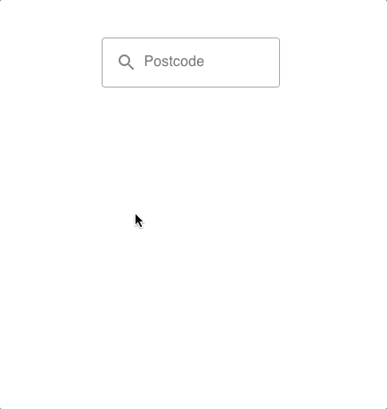

# Postcode Search: React Component



## Docs

#### Installing

- `yarn add postcode-search`

Make sure you have the peer dependencies installed too:

- `yarn add react prop-types`

#### Importing Component

```js
import PostcodeSearch from 'react-postcode'
```

#### Importing Styles

```js
import 'react-postcode/dist/index.css'
```

#### Props

- `apiKey: string`
- `apiUrl: string`
- `className: string`
- `label: string`
- `mapItem: func`
- `menuClassName: string`
- `onBlur: func`
- `onFetch: func`
- `onFocus: func`
- `onSelect: func`
- `outlined: bool`
- `style: object`
- `textFieldClassName: string`

#### Example

```jsx
import React from 'react'
import PostcodeSearch from 'react-postcode'
import 'react-postcode/dist/index.css'

const App = () => (
  <div style={{ maxWidth: '200px', margin: '100px auto', }}>
    <PostcodeSearch
      onFetch={postcode => {
        console.log(postcode)
      }}
    />
  </div>
)
```

## Developing

- `yarn`
- `yarn start`

The component is rendered at `http://localhost:3001` and updates automatically when editing the source code in [./src/index.js](./src/index.js).

## Publishing

- `yarn publish`
